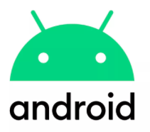
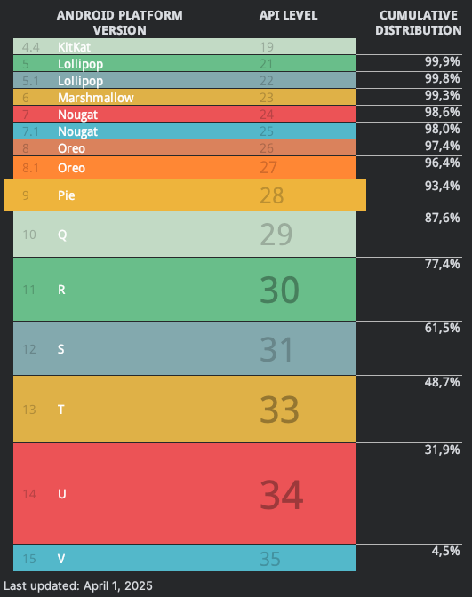
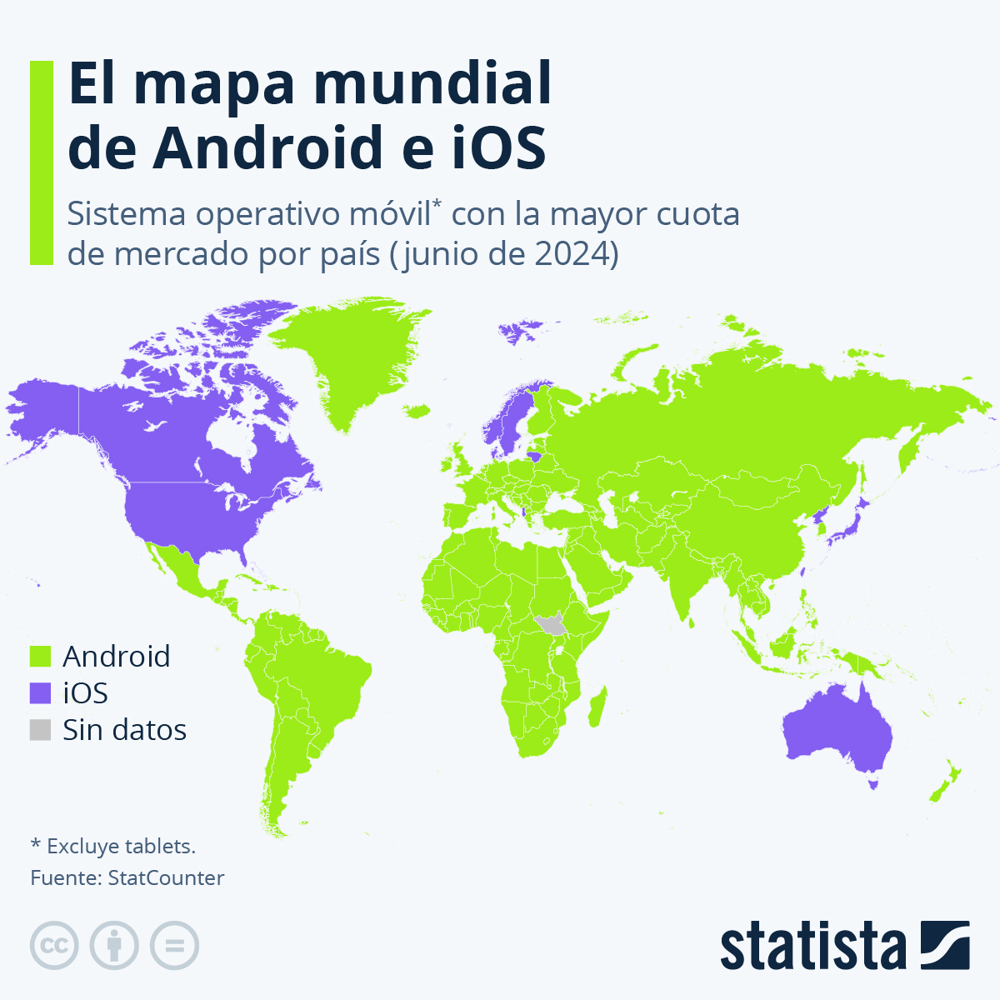
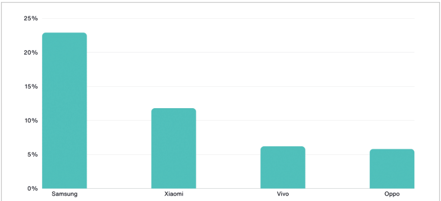
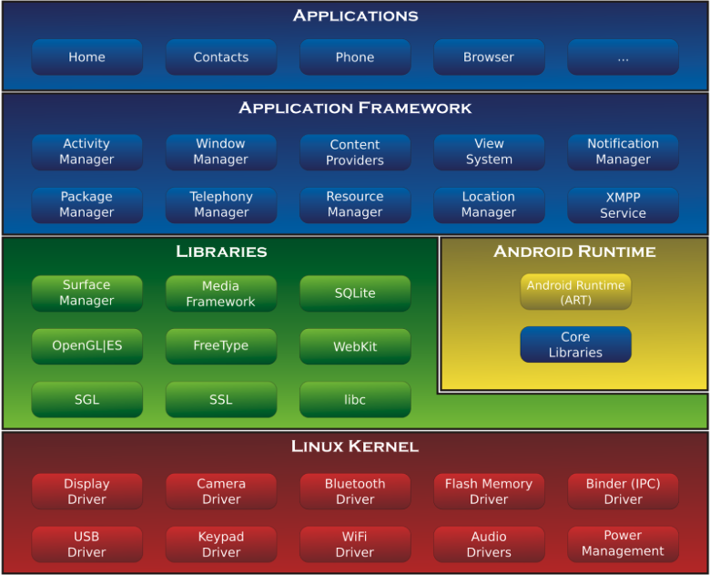

```
Programa de Ingeniería de Software

Título: Introducción al desarrollo de apps móviles
Duración estimada: 60
Docente: Carlos Andrés Florez
Guía: 01
```

## Marco Conceptual

Los dispositivos móviles han sido uno de los inventos más significativos de la era moderna. Desde sus primeras versiones en los años 70, que permitían la comunicación a través de redes celulares, hasta la explosión de funcionalidades actuales, han transformado radicalmente la forma en que nos comunicamos y accedemos a la información.

En 1977, se estableció la primera red celular en Chicago, seguida por Japón en 1979, marcando el inicio de la era de las telecomunicaciones móviles. Estas primeras redes, como la **1G**, tenían capacidades limitadas pero sentaron las bases para lo que hoy conocemos como telefonía móvil.

A finales de los años 90, los **SMS (Short Message Service)** revolucionaron la comunicación al permitir el envío de mensajes cortos entre usuarios de diferentes operadores. El primer **SMS** fue enviado en 1992, marcando el comienzo de una nueva era de comunicación digital que eventualmente superaría en popularidad a las llamadas de voz.

El desarrollo del sistema operativo **Symbian** por empresas como Nokia, Ericsson y Motorola en los años 90 y su posterior declive frente a iOS y Android ilustran la competencia feroz en el mercado de dispositivos móviles. Android, adquirido por Google en 2005, se lanzó en 2007 como un sistema operativo basado en Linux diseñado para dispositivos táctiles, consolidándose rápidamente como el líder del mercado.

Hoy en día, Android domina con una cuota de mercado superior al 70%, adaptándose no solo a teléfonos inteligentes, sino también a tabletas, wearables como los relojes inteligentes, y sistemas integrados en automóviles a través de Android Auto. Su éxito radica en su naturaleza de código abierto y la colaboración del **Open Handset Alliance**, que fomenta estándares abiertos y la innovación continua en dispositivos móviles.

---

## Información sobre algunos de los sistemas operativos para dispositivos móviles más destacados

El SO Symbian puede ser considerado el primero para teléfonos inteligentes, pero desde el año 2018 la competencia principal por el mercado la tienen Android e iOS. A continuación, se describen las características principales de algunos sistemas operativos (S.O) móviles:

### iOS

| **Logo:** |  |
|-----------|--------------------------------|
| **Descripción:** | Por sus siglas en inglés iPhone/iPod/iPad Operating System. iOS fue originalmente desarrollado para el iPhone, sin embargo, años después se extendió su uso en dispositivos como el iPod Touch, iPad y el Apple TV. Apple Inc. no permite la instalación de iOS en hardware de terceros. |
| **Lanzamiento:** | Su lanzamiento se dio el 26 de junio del 2007 con el nombre de iPhone OS, tres años después pasó a llamarse iOS. |
| **Proveedor:** | Es un sistema operativo móvil de la empresa **Apple Inc.** |
| **Lenguaje de Programación:** | Objective-C, Swift. |
| **Última versión estable:** | 18.6 - 29 de julio de 2025 |
| **Última versión beta:** | 26 beta 5 - 5 de agosto de 2025 |
| **Tienda de aplicaciones:** | App Store. |

### Android

| **Logo:** |  |
|-----------|-----------------------------------|
| **Descripción:** | El sistema operativo permite ejecutar aplicaciones programadas en Java bajo un entorno de ejecución llamado ART (anteriormente llamado Dalvik). El sistema operativo proporciona todas las interfaces necesarias para desarrollar aplicaciones que accedan a las funciones del teléfono (como el GPS, las llamadas, la agenda, etc.) de una forma muy sencilla en un lenguaje de programación muy conocido como es Java (o Kotlin). |
| **Lanzamiento:** | Android tuvo su lanzamiento oficial en septiembre del 2008. |
| **Proveedor:** | Inicialmente fue desarrollado por Android Inc., empresa que **Google** respaldó económicamente, para más tarde comprarla. |
| **Lenguaje de Programación:** | Java, Kotlin y C/C++. |
| **Última versión estable:** | Android 16 - 10 de junio de 2025 |
| **Tienda de aplicaciones:** | Google Play Store (tienda más reconocida). |

### Otros sistemas operativos móviles:

- **Symbian** (1997 - Octubre de 2012)
- **Windows Phone** (2010 - Abril de 2014)
- **Windows 10 Mobile** (2015 - Octubre de 2017)
- **Blackberry OS** (1999 - Abril de 2014)
- **Firefox OS** (2013 - Diciembre de 2015)
- **WebOS** (2009 - ?)
- **Ubuntu Touch** (2013 - Abril de 2017)

---

## Fragmentación

La fragmentación en Android es un problema porque el ecosistema está muy dividido en versiones, dispositivos y capas de personalización.
Esto significa que no todos los usuarios tienen la misma versión del sistema ni reciben las mismas actualizaciones al mismo tiempo, lo que trae varios inconvenientes.

Mientras iOS suele tener >90% de usuarios en la última versión al año de su lanzamiento, Android suele tener su versión más reciente en menos del 10% de dispositivos en ese mismo lapso.



### Algunas cifras del uso de dispositivos móviles en el mundo:

- Hay más de 3 mil millones de dispositivos con Android en el mundo
- En la actualidad existen aproximadamente 3.900.000 aplicaciones para Android.
- Android mantiene en la actualidad su posición como sistema operativo móvil líder a nivel mundial, con una cuota de mercado del 72,15%, mientras que iOS representa el 27,19%. Por número de países, Android es igualmente el sistema más usado.




- Samsung es el mayor aliado de Google.



---

## Arquitectura de Android

Podemos ver la arquitectura del sistema operativo de manera general en la siguiente imagen:



Aquí se pueden evidenciar las cinco capas principales, las cuales se describen a continuación:

| **Capa** | **Descripción** |
|----------|----------------|
| **El núcleo Linux** | El núcleo de Android está formado por el kernel Linux. Esta capa proporciona servicios como la seguridad, el manejo de la memoria, el multiproceso, la pila de protocolos y el soporte de *drivers* para dispositivos.<br><br>Esta capa del modelo actúa como capa de abstracción entre el hardware y el resto de la pila. Por lo tanto, es la única que es dependiente del hardware. |
| **Runtime de Android** | Está basado en el concepto de máquina virtual utilizado en Java. Dado las limitaciones de los dispositivos donde ha de correr Android (poca memoria y procesador limitado) no fue posible utilizar una máquina virtual Java estándar. Google tomó la decisión de crear la máquina virtual Dalvik.<br><br>A partir de Android 5.0 se reemplaza Dalvik por ART (Android Runtime). Esta nueva máquina virtual consigue reducir el tiempo de ejecución del código Java hasta en un 33%. |
| **Librerías nativas** | Incluye un conjunto de librerías en C/C++ usadas en varios componentes de Android. |
| **Entorno de aplicación** | Proporciona una plataforma de desarrollo libre para aplicaciones con gran riqueza e innovaciones (sensores, localización, servicios, barra de notificaciones, etc.).<br><br>Esta capa ha sido diseñada para simplificar la reutilización de componentes. Las aplicaciones pueden publicar sus capacidades y otras pueden hacer uso de ellas (sujetas a las restricciones de seguridad). Este mismo mecanismo permite a los usuarios reemplazar componentes. |
| **Aplicaciones** | Este nivel está formado por el conjunto de aplicaciones instaladas en una máquina Android. Todas las aplicaciones han de correr en la máquina virtual Dalvik para garantizar la seguridad del sistema.<br><br>Normalmente las aplicaciones Android están escritas en Java y Kotlin. Para desarrollar aplicaciones para Android podemos utilizar el Android SDK (*software development kit*). Existe otra opción que es el Android NDK (*Native Development Kit*) para crear apps con C/C++. |

---

## Para la próxima clase

- Investigar qué ventajas o beneficios tiene el uso de Kotlin por encima de Java.
- Investigar qué desventajas (o problemas) tiene el uso de Kotlin.
- Leer un poco sobre Jetpack Compose: [https://developer.android.com/compose](https://developer.android.com/compose)